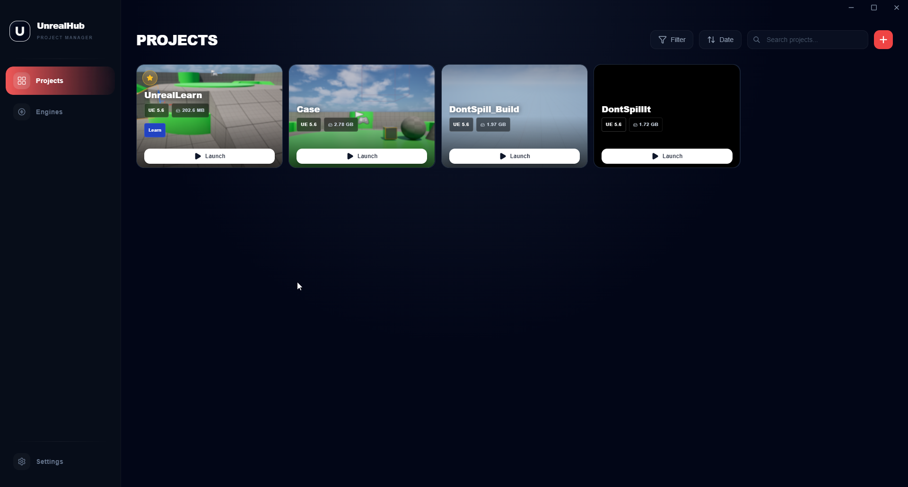
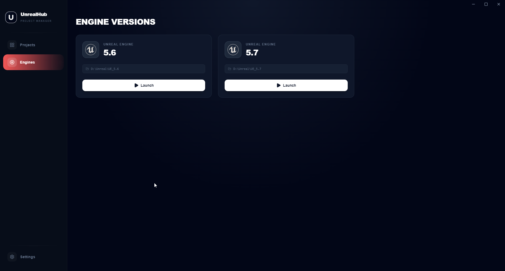
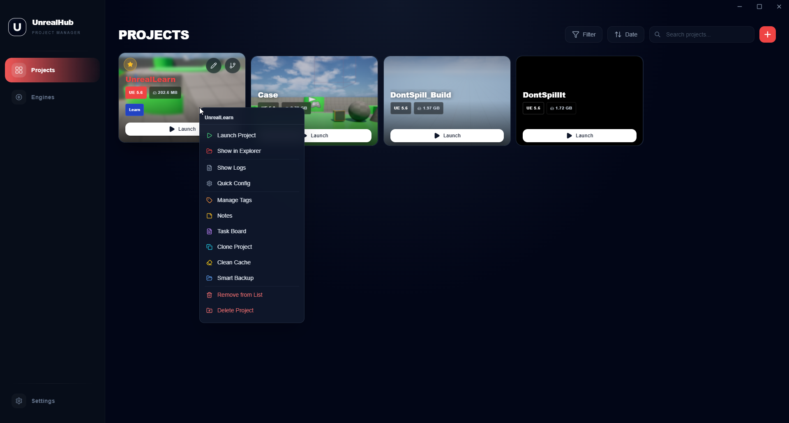
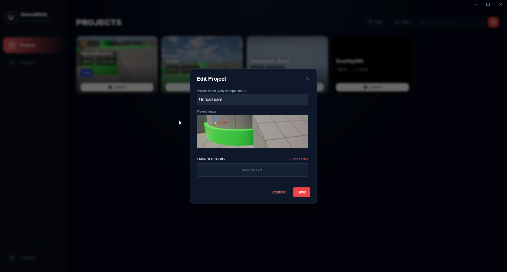
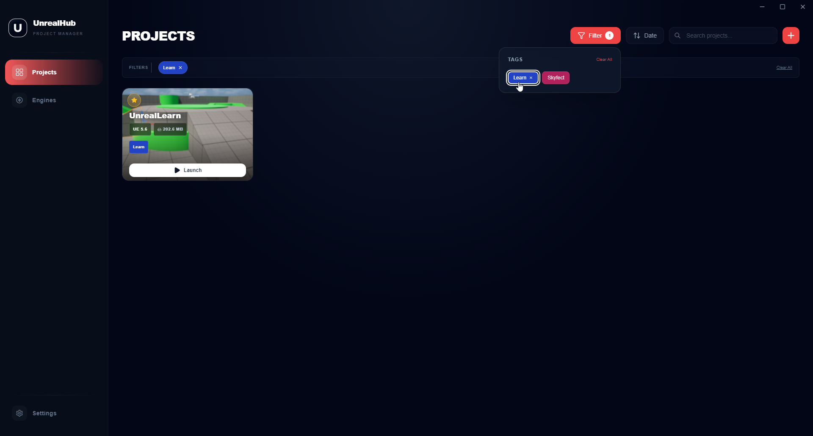
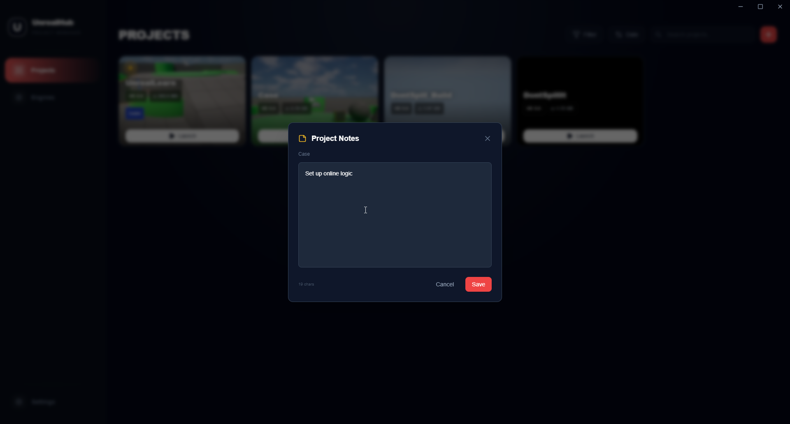
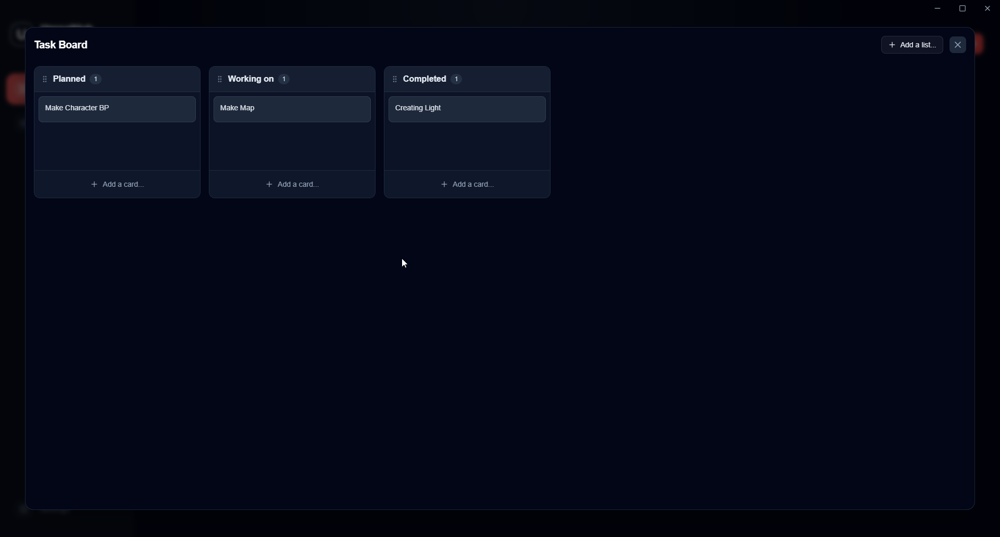
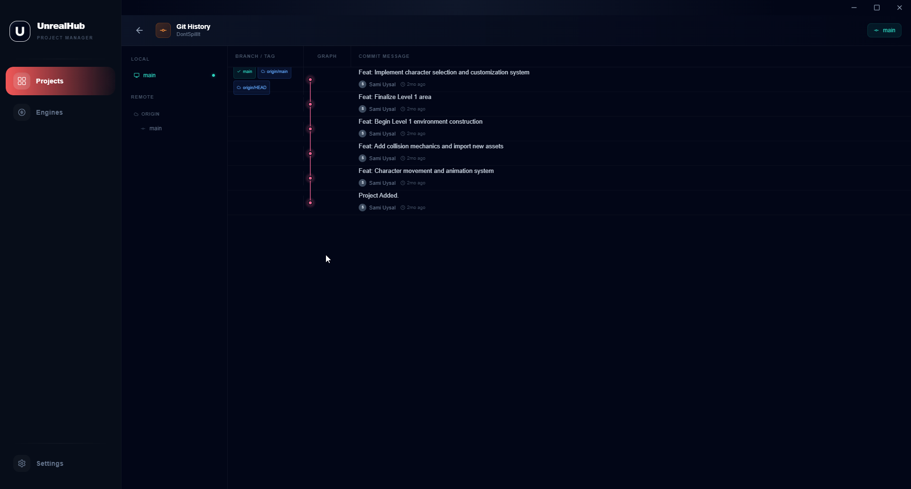
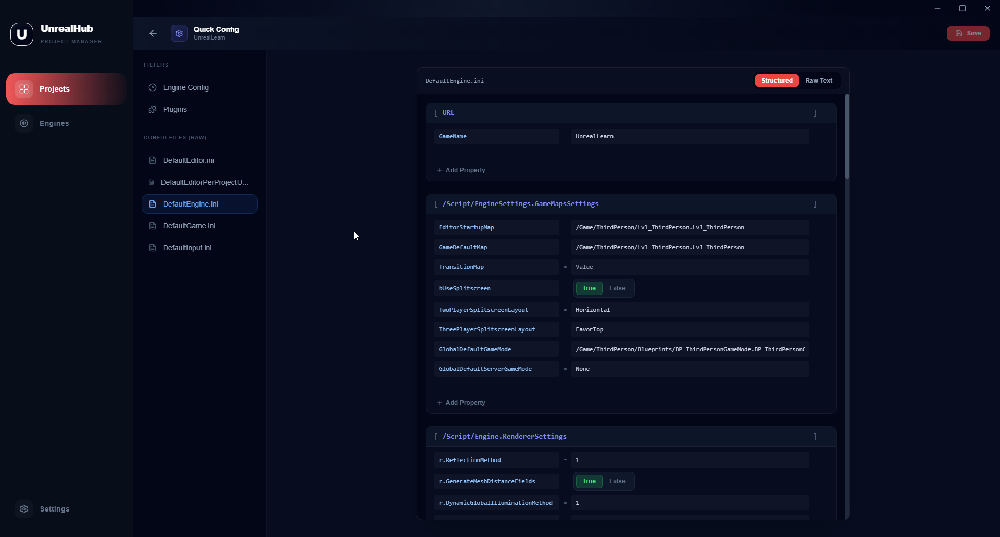

# UnrealHub

**Быстрая и лёгкая open-source альтернатива Epic Games Launcher для разработчиков Unreal Engine.**

**RU** | [EN](README_EN.md)

Надоело ждать пока Epic Games Launcher загрузится, чтобы просто открыть проект? **UnrealHub** — это десктопное приложение, заточенное под одну задачу: молниеносно управлять Unreal Engine проектами и установленными версиями движка.



## Epic Games Launcher vs UnrealHub

| Параметр | Epic Games Launcher | UnrealHub |
|---|---|---|
| **Скорость запуска** | ~10–15 секунд | **< 1 секунды** |
| **Фокус** | Магазин и игры | **Только твои проекты** |
| **Телеметрия** | Есть | **Нет (open source)** |
| **Офлайн-режим** | Кривой | **Нативно** |

## Почему UnrealHub

- **Мгновенный запуск.** Все UE-проекты в одном окне, открываются по клику.
- **Без мусора.** Никаких магазинов, рекламы и фоновых сервисов слежки.

---

## Возможности

### Управление движками
Автоматически находит все установленные версии Unreal Engine. Смотри и управляй ими в одном окне.

В Settings есть кнопка **«Найти Epic Games / UE»** — сканит стандартные локации (`C:\Program Files\Epic Games`, `D:\Epic Games` и т.д.) и добавляет найденные пути одним кликом.



### Продвинутое управление проектами
Каждый проект показывает реальный размер на диске. Через контекстное меню (правый клик) — клонировать, удалить, чистить `Saved`/`Intermediate`, делать умные **.zip-бэкапы**.



### Кастомизация и теги
Меняй имя и обложку проекта прямо в приложении.


Теги для своей системы организации.


### Инструменты для разработчика

**Заметки по проекту (с Markdown)**
Идеи, todo, детали проекта — прямо в приложении.


**Доска задач (Kanban)**
Встроенный drag-and-drop Kanban для проектов. **Теперь доступна как отдельная вкладка** в боковом меню — сетка плиток со всеми проектами, у которых есть доска.


**Контроль версий**
- **Git** — история коммитов и веток прямо в окне (для проектов с `.git`).
- **Diversion** — интеграция через локальную CLI `dv` (история коммитов, статус воркспейса, ветки).
- **Выбор VCS per-project**: в Edit Project можно поставить *Default / Git / Diversion / Both / None* — карточка проекта будет показывать только нужные кнопки.



**Редактор плагинов и конфигов**
Включай/выключай плагины `.uproject` или правь `DefaultEngine.ini` без запуска движка.


### Marketplace и Epic Auth
Логин в Epic Games через встроенное OAuth-окно, просмотр своей библиотеки Marketplace, скачивание ассетов в Vault Cache. Никаких лишних шагов с токенами — авторизация работает «из коробки».

---

## Установка

**Скачай последний `.exe` из [Releases](../../releases)**

Установка в один клик — скачал и через несколько секунд работаешь.

## Интеграция с Flow Launcher
Хочешь больше скорости? Есть плагин для [Flow Launcher](https://www.flowlauncher.com/) — открывай любой UE-проект с клавиатуры через `Alt + Space`.

## Локализация
Интерфейс на трёх языках: **English**, **Русский**, **Türkçe**. Переключается в Settings → Appearance → Language.

## Разработка

<details>
<summary>Инструкции для разработчиков</summary>

```bash
# Установить зависимости
npm install

# Запустить в dev-режиме
npm run dev

# Собрать установщик
npm run build
```

Установщик появится в папке `release/`.

**Технологии:** Electron, React + TypeScript, Vite, TailwindCSS, `simple-git` (Git), нативный вызов `dv` CLI (Diversion), `keytar` (хранение токенов в системном хранилище ключей).

</details>

## Лицензия
Проект open-source, под лицензией MIT — бери, используй, форкай. Это персональный форк с расширениями поверх оригинального UnrealHub.
